#### 

- Màquines Virtuals (IMPORTANT 2 INTERFÍCIES DE XARXA)  
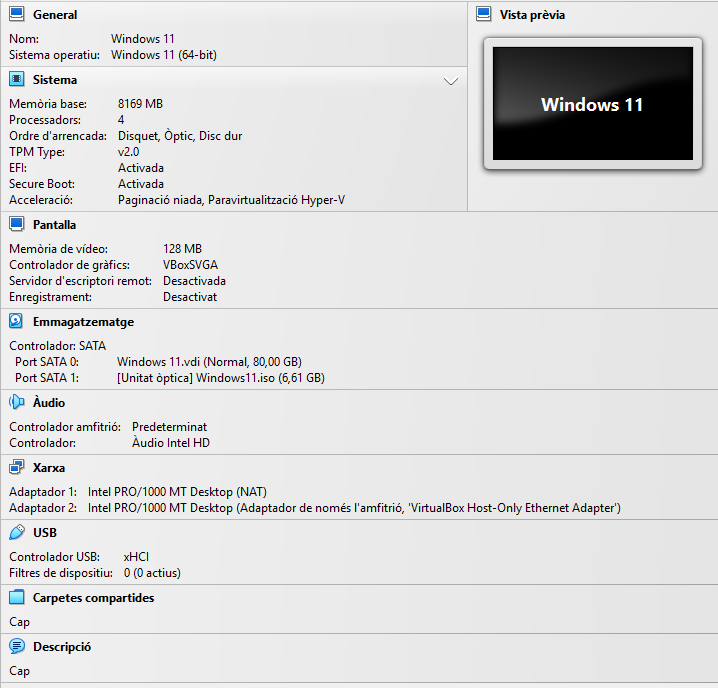
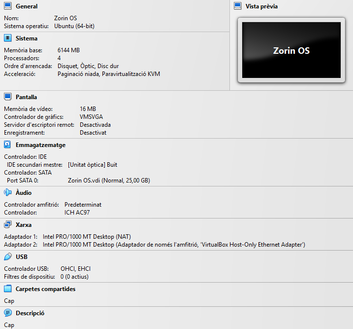

- Amb la següent comanda instal·larem el servei SSH:  
  sudo apt install ssh  
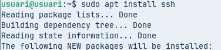
- A la nostra màquina Linux utilitzarem la següent comanda per saber la seva IP:  
  ip a  
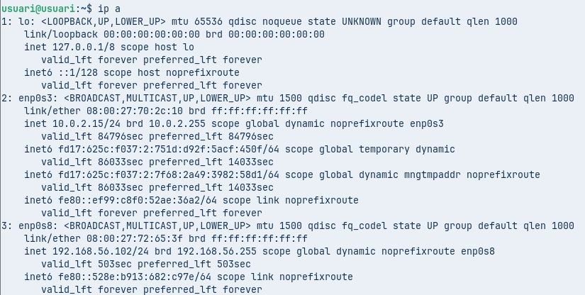
- Ens connectarem per SSH des de la nostra màquina Windows. Quan introduïm l’usuari i la IP, ens indicarà que la clau del servidor SSH no té cap altre registre i ens preguntarà si estem segurs que ens hi volem connectar. Direm que **sí** i ens advertirà que ha afegit el servidor de manera permanent a la llista de servidors coneguts.  
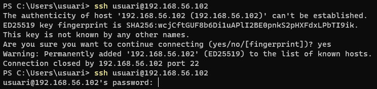

- Habilitarem l’usuari *root* posant-li una contrasenya.  
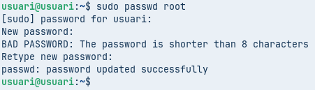
- Al final de l’arxiu de configuració `/etc/ssh/sshd_config` afegirem la següent línia.  
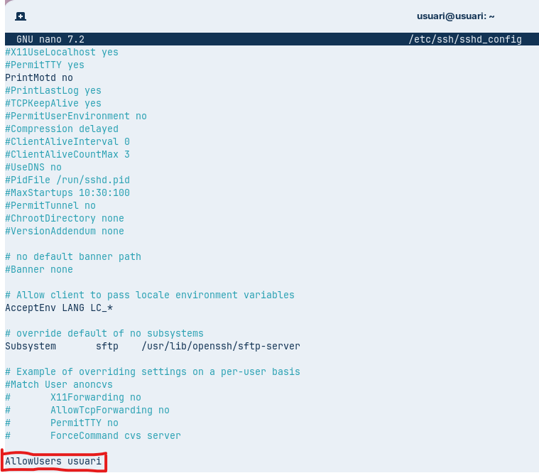
- Després farem login localment amb l’usuari *root*.  
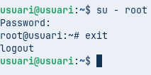
- Intentarem fer SSH des de la nostra màquina Windows amb l’usuari *root* i veurem que ens retorna *access denied*.  
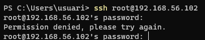
- Amb la següent comanda a la nostra màquina Windows generarem un parell de claus RSA.  

- Després, amb la comanda `ls`, comprovarem que tenim els arxius necessaris. L’arxiu que hem de copiar al nostre servidor és el que acaba en `.pub`. El copiarem amb la comanda `scp`.  
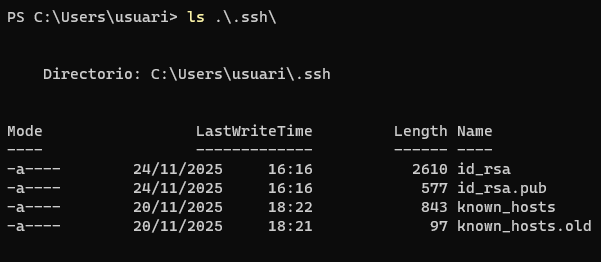
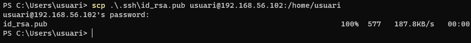
- Crearem al nostre servidor Linux el següent arxiu dins la carpeta `.ssh`:

- A continuació, copiarem dins d’aquest arxiu la clau `id_rsa.pub`.
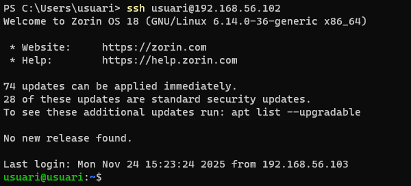
- Comprovarem des de la màquina Windows 11 que podem fer SSH sense necessitat d’introduir la contrasenya.  

- Per poder tenir el nostre servidor OpenSSH a Windows 11, anirem a:  
- **Configuració → Sistema → Característiques opcionals**  
   Premem el botó blau **"Veure característiques"**.  
- Dins d’aquest apartat cercarem **OpenSSH Server**, marcarem la casella i premem **Afegeix**.  
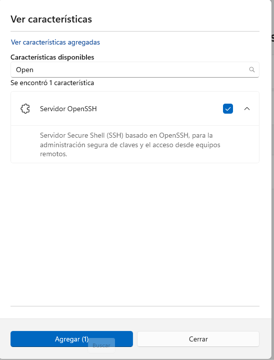 
- Per encendre el servei SSH:  

- Per fer que s'activi automàticament a l’inici:  

- Com podem veure, si fem una connexió SSH ens podrem connectar de Linux a Windows.

- Si no podem establir la connexió SSH, caldrà deshabilitar temporalment el firewall de Windows.

- A la nostra màquina Windows executarem la següent comanda. **NO TANQUEM AQUESTA CONNEXIÓ SSH.**

- Si afegim l’opció `-D` a la comanda SSH, es crea un proxy SOCKS dinàmic al port que especifiquem.  
  \`\`\`bash  
  ssh \-D 9876 usuari@192.168.56.102  
  \`\`\`  
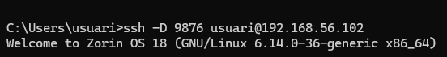
- Entrarem a **Opcions d’Internet** i seguirem els passos per crear el túnel SSH.  
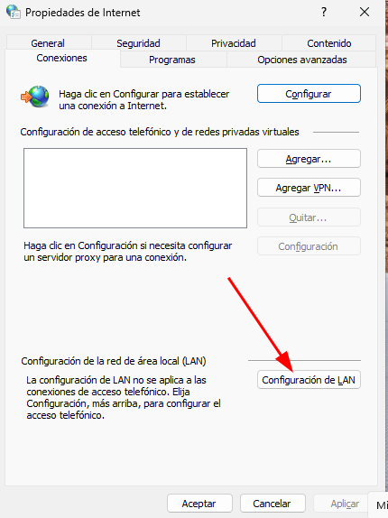
- Anirem a:  
- **Connexions → Configuració de LAN**  

- Deixarem les opcions tal com apareixen a la captura i premem **Opcions avançades**.  
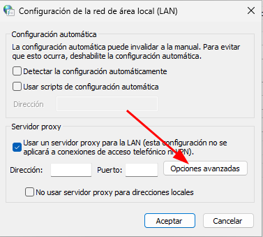
- A l’apartat *SOCKS*, posarem la IP de la nostra màquina local (client SSH) i el port **9876**. Finalment, acceptarem tots els canvis.  

- Instal·larem l’aplicació [Wireshark](https://www.wireshark.org/) a Windows 11\.

- Podrem apreciar com la informació viatja encriptada.  

