# **1. Preparació de l’entorn**

- Maquines Virtuals  
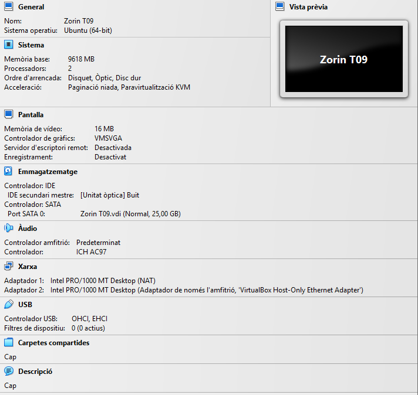
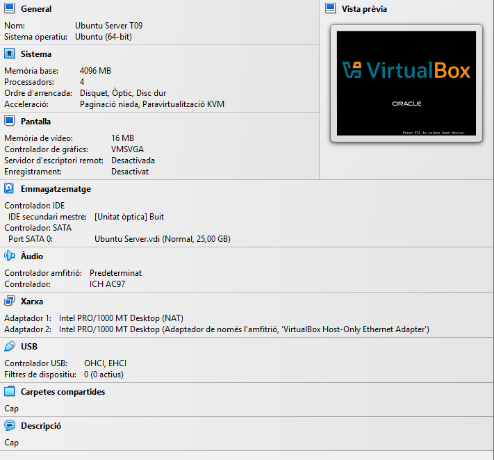

# **2. Preparació del servidor**

- Farem un ping a la maquina client desde la maquina server per assegurar la connectivitat 
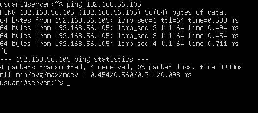
- Començarem creant el grup devs i el grup admins  
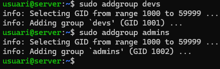
- Crearem l’usuari dev01 amb carpeta personal  
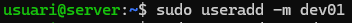
- L’afagirem com a grup secundari a devs  
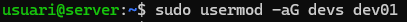
- Crearem l’usuari amb carpeta personal admin01 i l’afagirem al grup secundari admins  
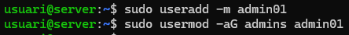
- Crearem els seguents directoris /srv/nfs/dev\_projects crearem tambe la carpeta admin\_tools  
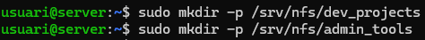
- donarem el usuari propietari root als 2 directoris dev\_projects i admin\_tools i de grup propietari admin per admin\_tools i devs per dev\_projects dibaren els permisos 770  
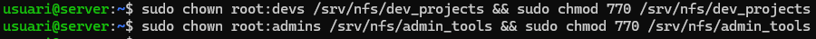
- Posarem com a propietari de /srv/nfs cap usuari ni grup i posarem de permisos 770  
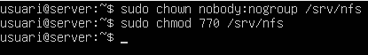
- Afagirem els mateixos grups i usuaris al client  
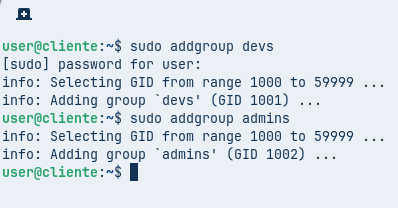
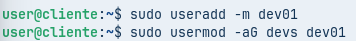
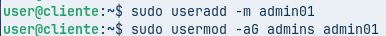
- Instalarem el servei client nfs a la maquina client  
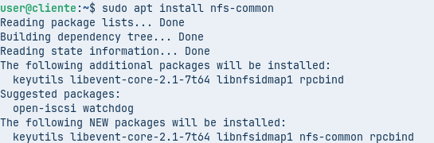
- Instalarem el servei de nfs server al nostre server  
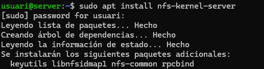
- Editarem el arxiu de /etc/exports i compartirem la carpeta /srv/nfs a la nostra maquina client (posarem la ip del client perquè \* pot donar problemes de manera inexplicable)  
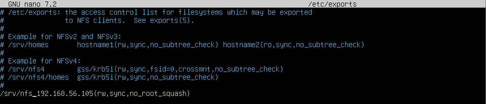
- Ara reinciarem el servei   
- utilitzarem showmount per veure que recursos ens esta compartint el server  
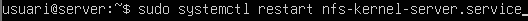
- crearem un directori en el cual montarem el directori que ens esta compartint el server  
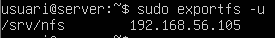
- Muntarem el directori que ens comparteix el server a la carpeta que em creat  
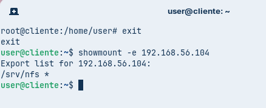
- Veurem que tenim els directoris que hem muntat que ens ha compartit el server   

# **3. L’exportació d’administració.**

- editem el arxiu de /etc/exports i compartirem ara la carpeta /srv/nfs/admin\_tools amb els permisos rw, sync  

- Reiniciem el servei nfs al server  
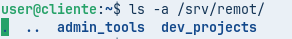
- Amb la comanda comprovarem que s’estigui compartint el directori correcte  
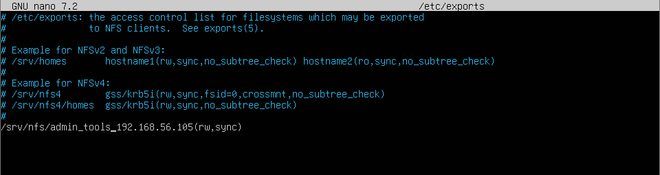
- Crearem el seguent directori /mnt/admin\_tools per montar admin\_tools  

- Ara montarem el directori compartit del server a la carpeta que em creat abanç  
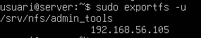

## **3.1 El dilema del root\_squash**

- El dilema del **root Squash:** Si intentas accedir o crear al directori /mnt/admin\_tools com a root no ens deixara, aixo es degut a que per default nfs te la opcio root\_squash habilitada. Aquesta opcio fa que el usuari root del client sigui nobody al server i aques usuari no té permisos per que no esta dins de cap grup o usuari amb permisos.  
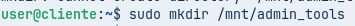
- Ara amb admin01 si que podem accedir ja que forma part del grup propietari de la carpeta admins.  

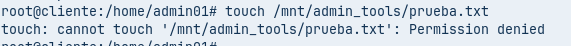

## **3.2 Solució del dilema del root\_squash**

- Ara cambiarem les opcions del recurs compartit i posarem no\_root\_squash el que deshabilitarà aquesta protecció.  

- **Reiniciem el servei**  
  sudo systemctl restart nfs-kernel-server.service  
- desmontem el recurs compartit i el tornem a montar per que s’apliquin els cambis  
  sudo umount /mnt/admin\_tools  
  sudo mount \-t nfs 192.168.56.203:/srv/nfs/admin\_tools /mnt/admin\_tools  
- Com podem veure ja ens deixa crear un arxiu com a root degut a que ara estem com a root pel server també  
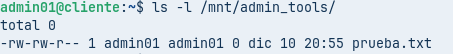 
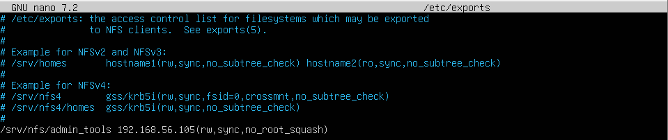

# **4. L’exportació de Desenvolupament**

- Ara editarem l’arxiu /etc/exports i posarem que es comparteixi amb permisos de escriure i llegir al nostre client pero que per la resta de la xarxa només puguin llegir  

- reiniciem el servei  
  sudo systemctl restart nfs-kernel-server.service  
- Crearem al client el directori per muntar el recurs i muntarem el recurs   
  sudo mkdir /mnt/dev\_projects  
  sudo mount \-t nfs 192.168.56.104:/srv/nfs/dev\_projects /mnt/dev\_projects  
- Entrarem com a dev01 i escriurem al directori  
  touch /mnt/dev\_projects/dev01.txt  
 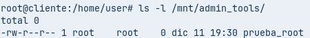
- desmuntem el recurs compartit  
  sudo umount /mnt/dev\_projects  
- cambiem la ip per una que estigui dins del rang de ips que em configurat abanç  
  ip a  
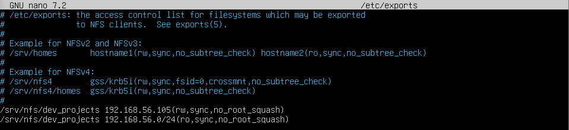
- amb la ip muntem el recurs i veurem com nomes podem llegir encara que siguem com a dev  
  touch /mnt/dev\_projects/dev01.txt  
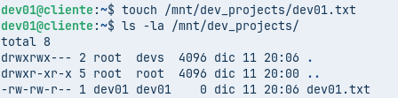
- Cambiem a admin01 i intentem esciure veurem com el codi de error es diferent  
  touch /mnt/dev\_projects/admin01.txt  
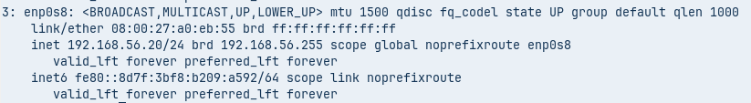

# **5. Muntatge Automatic amb /etc/fstab**

- Em de tenir tots els recursos que volem compartir al arxiu /etc/exports al server  
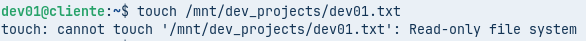
- Una vegada asegurat aixo editarem l’arxiu /etc/fstab aixo amb la finalitat de muntar els recursos automaticament cada vegada que reiniciem el sistema posem:  
  ip:/ruta /ruta\_per\_muntar nfs default 0 0  
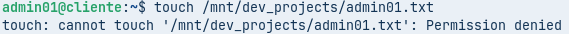
- Comprobarem si les entrades funcionen sense reiniciar amb  
  sudo mount \-a  
- Reiniciarem la maquina i mirarem si s’han muntat els recursos compartits  
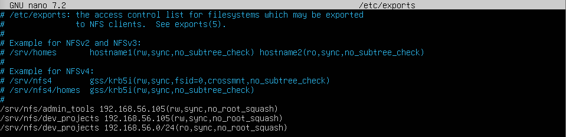
- com podem veure s’han muntat correctament	
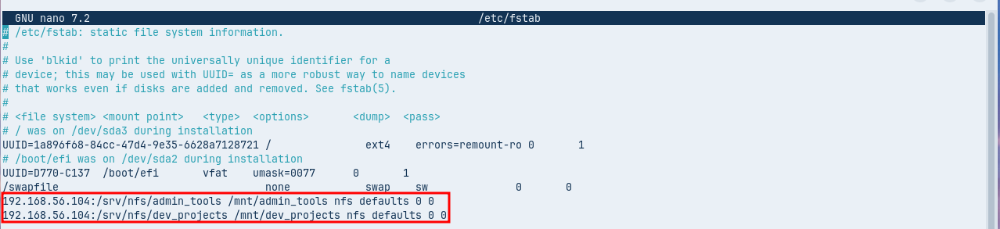
# **6. Conclusió**

Dins de aquesta experiencia amb NFS he pugut veure que es una bona alternativa tot i que em sembla poc practic per part dels tecnics i poc escalable dins de un entorn més gran degut a que la seva configuracio depen de que els GID i UID coincideixin entre client i server a més tambe es poc segur  
seria aconsejable anar-se a un servei de identitat centralitzada com ldap la cual es una opcio molt més segura i escalable en un entorn laborable
